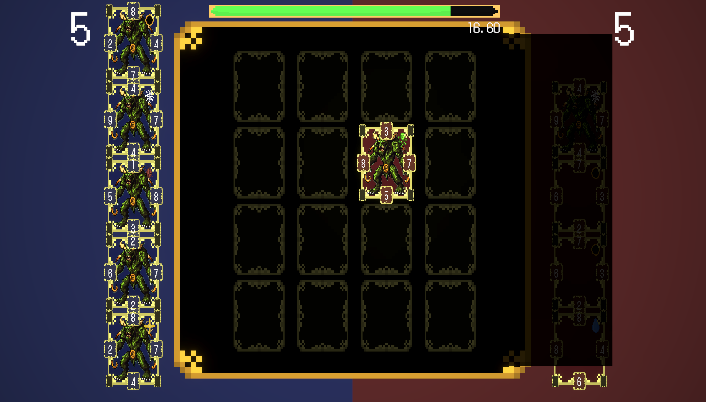

# 🎴 EterraCards 🎴
EterraCards is a card game intended as a launch point and companion app for a suite of web3 interconnected games. 

## User interface 👀
### Menu

### Settings

### Collection

### Deck selection

### Deck editor

### Gameplay

## How to play? 🎮
You are the blue team and your objective is to capture as many cards from the red team as possible.
If your points are greater than 5 you win, else you will lose.
Each side of your card has a power level, if it is greater than the opposite side power of the enemy's card you will capture his card.
Each corner of your card uses randomly set genetics (to be derived from on-chain assets) to decide captures in ordinal battles. 

The game has different rules that can be enable or disable.

### Elemental rule
In the elemental rule, one or more of the slots are randomly marked with an element. Some cards have elements in the upper-right corner. 
If the card has an element and match with the slot's element, the power of the card will increase in 1. Else will decrease in 1.

### Random rule 
Five cards are randomly chosen from the player's deck instead of the player being able to choose five cards themselves.

### Same rule (To be removed)
When a card is placed touching two or more other cards (one or both of them have to be the opposite color), and the touching sides of each card is the same, then the other two cards are flipped. Combo rule applies.

### Plus rule (To be removed)
When one card is placed touching two others and the power touching the cards plus the opposing power equal the same sum, then both cards are captured. Combo rule applies.

### Same wall rule (To be removed)
An extension of the Same rule. The edges of the board are counted as 10 power for the purposes of the Same rule. Combo rule applies.

### Sudden death rule (To be removed?)
If the game ends in a draw, a sudden death occurs in which a new game is started but the cards are distributed on the side of the color they were on at the end of the game.

### Combos (To be removed)
Of the cards captured by the Same, Same Wall or Plus rule, if they are adjacent to another card whose power is lower, it is captured as well.

## Art 🎨 (To be replaced)
Every piece of art in this project was self-made using Aseprite.

## Game localization
Uses the Unity localization package v1.0.5.
The game is available to play in both English and Spanish.

## Features ✔️
- [x] Capture cards.
- [x] CardBrawl battles.
- [x] Easy card creation.
- [x] Points system.
- [x] Turn system.
- [x] Elemental rule.
- [x] Random rule.
- [x] Same rule. (To be removed)
- [x] Plus rule. (To be removed)
- [x] Same wall rule. (To be removed)
- [x] Sudden death rule. (To be removed)
- [x] Combos. (To be removed)
- [x] Enemy basic AI. (Might be updated to consider card battles?)
- [x] Enemy advanced AI. (Must be updated to consider card battles)
- [x] Turn timer.
- [x] Settings (including rule settings).
- [x] Deck building.
- [x] Unlocking cards. (To be replaced)
- [x] Game localization.
- [ ] Card Purchase
- [ ] Card Crafting (Forge)
- [ ] Resource Crafting (Alchemy, Synthesis)
- [ ] Resource Drops
- [ ] Token Drops
- [ ] Card/Resource Wallet
- [ ] Web3 Front End (Wallet Creation/Login)
- [ ] Web3 Back End (Game Administration)
- [ ] Web3 Asset Management
